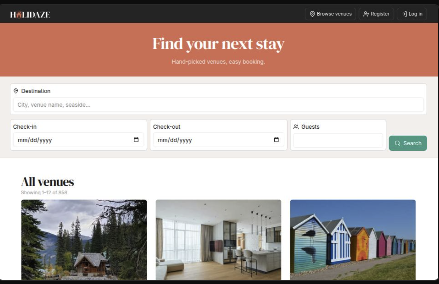

# Holidaze

A modern accommodation booking site built with **Next.js**, **TypeScript**, and **Tailwind CSS**.  
Implements both customer and venue manager flows against the Noroff v2 **Holidaze** API.

**Live:** https://holidaze-ten.vercel.app  
**Repo:** https://github.com/Inamarie84/holidaze

---

## ✨ Features

### For everyone

- Browse venues (paginated grid)
- Search by destination, dates, guests
- Venue details with gallery, amenities, and availability calendar
- Mobile-first, responsive UI

### Customers

- Register / Login / Logout (Noroff `@stud.noroff.no` email)
- Create bookings
- See upcoming & previous bookings in profile
- Update avatar

### Venue Managers

- Register / Login / Logout (Noroff `@stud.noroff.no` email)
- Create, edit, and delete venues
- See upcoming bookings for their venues
- Update avatar

### DX & Quality

- Next.js App Router
- Type-safe API helpers
- Persisted session with Zustand
- Toasts for feedback
- Accessible tooltips & skeleton UIs

---

## 🧱 Tech Stack

- **Framework:** Next.js (App Router)
- **Language:** TypeScript
- **Styling:** Tailwind CSS
- **State:** Zustand (persisted)
- **UI / Icons:** lucide-react, react-hot-toast
- **Testing:** Jest + React Testing Library
- **Lint/Format:** ESLint + Prettier
- **Node:** ≥ 18
- **Deploy:** Vercel

---

## 🧭 Roles & Terminology

- **Visitor:** not logged in
- **Customer:** logged-in user who books venues
- **Venue Manager:** logged-in user who manages venues (CRUD venues)

---

## 📁 Project Structure (high-level)

src/
app/
(with-search)/
venues/ # /venues listing (server entry + client components)
profile/ # /profile (server wrapper + client page)
login/ # auth page
register/ # auth page
api/ # route handlers (if any)
layout.tsx # global layout
components/ # UI and feature components
lib/ # api.ts, holidaze.ts, env helpers
services/ # API calls (auth, profiles, venues, bookings)
store/ # Zustand session store
types/ # shared TypeScript types
public/
readme/ # screenshots for README
icon.png # app icon (Next auto-uses /icon.png)
images/ # placeholder assets

## 🚀 Getting Started (Local)

1. **Clone**

```bash
git clone https://github.com/Inamarie84/holidaze.git
cd holidaze
```

3. Install dependencies:

```bash
npm install

```

4. Environment Variables – create .env.local:

```bash
# Base Noroff v2 API (no trailing slash)
NEXT_PUBLIC_API_URL=https://v2.api.noroff.dev


# Required for /holidaze/* endpoints (you can get your own key from https://api.noroff.dev)
NEXT_PUBLIC_API_KEY=YOUR_API_KEY_HERE

```

5. Run the development server: (http://localhost:3000)

```bash
npm run dev

```

6. Other scripts:

```bash
npm run build      # Create an optimized production build
npm run start      # Start the production server
npm run lint       # Run ESLint
npm run test       # Run tests with Jest
npm run prettier    # Run Prettier to format code

```

## 🌍 Deployment (Vercel)

1. Connect the repo on Vercel.
2. In **Project → Settings → Environment Variables**, add for **all environments**
   (Production / Preview / Development):

- NEXT_PUBLIC_API_URL=https://v2.api.noroff.dev
- NEXT_PUBLIC_API_KEY=YOUR_API_KEY_HERE

3. Trigger a deploy (push to `main`).

````

## 🌐 API usage

All data comes from the Noroff v2 API (Holidaze).

**Common calls:**
- Venues (list): `/holidaze/venues?page=&limit=&_bookings=true`
- Venue (by id): `/holidaze/venues/:id?_bookings=true&_owner=true`
- Profiles (self): `/holidaze/profiles/:username`
- Bookings (self): `/holidaze/profiles/:username/bookings?_venue=true`
- Manager CRUD: `/holidaze/venues` (requires auth + `venueManager`)

**Helper behavior:**
- Adds `Authorization: Bearer <token>` when available
- Adds `X-Noroff-API-Key` for `/holidaze/*` routes
- Normalizes API errors into friendly messages

## 🔐 Auth & session

- Successful login/register stores `{ token, user }` in a persisted Zustand store (`localStorage`).
- `AuthGate` guards protected pages; `SessionHydrator` prevents hydration flicker.
- After login, users are redirected back to their intended page.


## 🧪 Testing

- Unit / component tests with **Jest** + **React Testing Library**

**Run:**
```bash
npm test


## 🌍 Deployment (Vercel)

1. Connect the repo on Vercel.
2. In **Project → Settings → Environment Variables**, add for **all environments**
   (Production / Preview / Development):

- NEXT_PUBLIC_API_URL=https://v2.api.noroff.dev
- NEXT_PUBLIC_API_KEY=YOUR_API_KEY_HERE

3. Trigger a deploy (push to `main`).

```


---

### ✅ Screenshots (ensure the path is correct and the file is committed)
```markdown
## 🧑‍🎨 Screenshots




## ♿ Accessibility & UX

- Keyboard-focusable controls
- Tooltip hints on icon-only buttons (hidden on larger screens where text is visible)
- Semantic headings and ARIA `role="status"` for async feedback
- Color contrast checked for navbar/hero overlays

## 🛠 Troubleshooting

- **Looks tiny or “zoomed out”**: Reset browser zoom to 100% (`Cmd/Ctrl + 0`).
- **Images via `<Image />` 502/403**: Ensure external domains are allowed in `next.config.js` (`images.remotePatterns` or `images.domains`).
- **404 favicon**: Keep `src/app/icon.png` (Next generates `/icon.png`).
- **“Missing NEXT_PUBLIC_API_URL”**: Add required env vars in Vercel and redeploy.
- **Auth works locally but not on Vercel**: Confirm both `NEXT_PUBLIC_API_URL` and `NEXT_PUBLIC_API_KEY` exist for Production & Preview.


## 📝 Notes

- **Home vs Venues**: The home route redirects to `/venues`. This is fine and common when the listing is the main experience.
- **Titles/Metadata**: The app uses a layout title template and per-page metadata (or a client `TitleSync` for dynamic titles like the profile username). This is the standard Next.js approach (rather than editing static HTML).

## 📄 License

MIT © 2025 Inamarie Forseth
````
